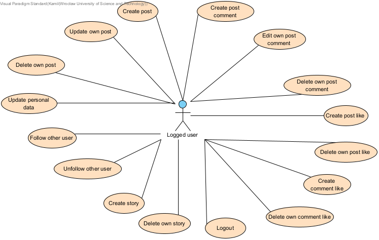

# Instagram copy 
This app is mostly a simplified copy of Instagram in terms of its functions and website layout.

## Functional requirements:
* Posts (in progress),
* Posts' comments (in progress),
* Rating posts' comments (in progress),
* Rating posts (in progress),
* Following (in progress),
* Stories (in progress),
* Simple chat app (in progress).

## Use cases:

    

    

    

    

## Main app's erd diagram:

## Technologies:
* Frontend:
    * ReactJS,
    * TypeScript,
    * ReduxJS.
* Backend:
    * Java
    * Spring Boot,
    * Spring Data JPA,
    * Spring Security,
	* Spring Cloud (in the future),
	* Liquibase,
	* REST Assured,
	* Testcontainers.
 * Database - PostgreSQL,
 * General:
    * Communication messages - REST,
	* Architecture - microservices (basic Instagram functions and chat are isolated components)
    * External authentication and authorization provider - Auth0.
 * Deploy:
    * Docker,
    * Docker images repository - Docker Hub,
	* Message broker - Kafka (in the future),
	* CI/CD - GitHub Actions (in the future) i ArgoCD (in the future)
    * Orchestration - Kubernetes,
    * Cloud - Azure AKS (in the future).
