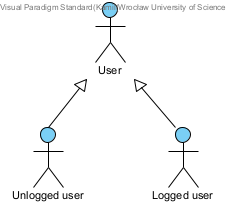
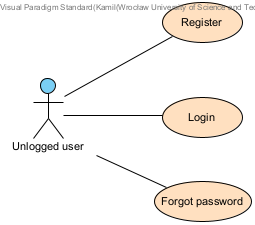
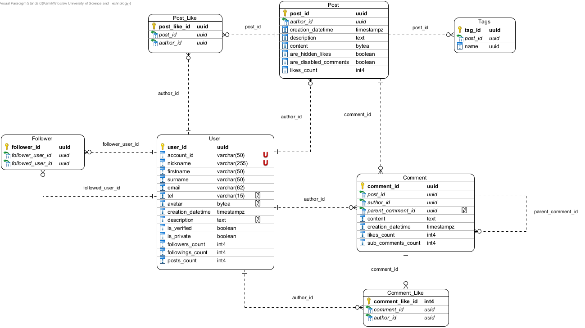

# Instagram copy 
Aplikacja jest mocno uproszczoną kopią Instagrama biorąc pod uwagę jej funkcje oraz wygląd strony.       

## Wymagania funkcjonalne:
* Posty (w trakcie),
* Komentarze postów (w trakcie),
* Ocenianie komentarzy (w trakcie),
* Ocenianie postów (w trakcie),
* Obserwowanie (w trakcie),
* Stories (w trakcie),
* Prosty messenger (w trakcie).

## Przypadki użycia:

## Główny schemat bazy danych:

## Technologie:
* Frontend:
    * ReactJS,
    * TypeScript,
    * ReduxJS.
* Backend:
    * Java
    * Spring Boot,
    * Spring Data JPA,
    * Spring Security,
	* Spring Cloud (docelowo),
	* Liquibase,
	* REST Assured (docelowo),
	* Testcontainers (docelowo).
 * Baza danych - PostgreSQL,
 * Ogólne:
    * Kominikacja - REST,
	* Architektura - mikroserwisy (osobno podstawowe funkcje instagrama i komunikator)
    * Zewnętrzny serwer uwierzytelniający - Auth0.
 * Wdrożenie:
    * Docker,
    * Repozytorium obrazów dockerowych - Docker Hub,
	* Broker wiadomości - Kafka (docelowo),
	* CI/CD - GitHub Actions (docelowo) i ArgoCD (docelowo)
    * Orkiestracja - Kubernetes,
    * Chmura - Azure AKS (docelowo).
