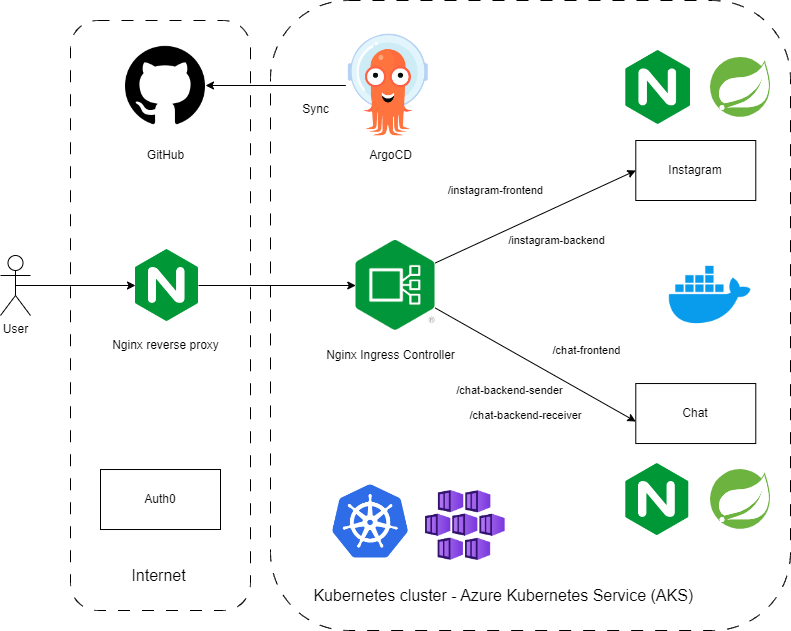
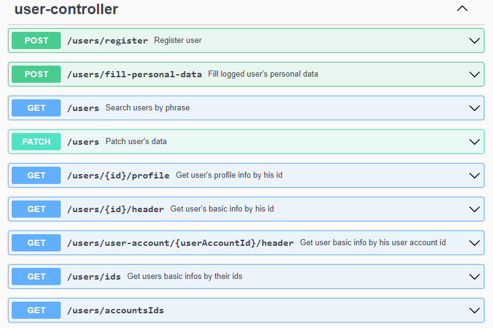

# Instagram copy 
This app is mostly a simplified copy of Instagram in terms of its functions and website layout. This project finished. It is divided on 2 parts: first part is containing basic functions of instagram e.g. posts and other part is real time chat.

I finished both instagram and chat.

## Running app

### Local light Kubernetes cluster
To test all app's functionalities, I prefer to setup the app locally in the Kubernetes cluster.
One of the most popular light versions of Kubernetes is [minikube](https://minikube.sigs.k8s.io/docs/start/?arch=%2Fwindows%2Fx86-64%2Fstable%2F.exe+download).

Tutorial about how to install minikube: https://minikube.sigs.k8s.io/docs/.

If you now have minikube, next step is to create minikube cluster by:
```
minikube start
```

Later enable ingress (gateway which routes requests to specific services based on path) extension:
```
minikube addons enable ingress
```

Next step is installing ArgoCD, which makes continous delivery easy.
a) First create ArgoCD namespace:
```
kubectl create namespace argocd
```

b) Then install ArgoCD in concected cluster:
```
kubectl apply -n argocd -f https://raw.githubusercontent.com/argoproj/argo-cd/stable/manifests/install.yaml
```

c) Get initial password to ArgoCD dashboard:
```
kubectl get secret argocd-initial-admin-secret -n argocd -o yaml
```

Sample result:
```yaml
apiVersion: v1
data:
  password: MzRIMTZodk1hWVdydFNqYg==
kind: Secret
metadata:
  creationTimestamp: "2024-10-03T13:25:16Z"
  name: argocd-initial-admin-secret
  namespace: argocd
  resourceVersion: "866"
  uid: bb76fe3a-36c5-473f-b974-5513a91ac677
type: Opaque
```

The password is encoded in base64, so to use this password, it is necessary to decode it first.

Login is `admin`.

d) Last step to setup ArgoCD is connecting to its service e.g. by forwarding its port:
```
kubectl port-forward svc/argocd-server -n argocd 8080:443
```

ArgoCD is now available on port 8080.

e) The best way to run the app now is to use command
```
kubectl apply -f <application_name>.yaml
```

for all yaml files in the `code/argocd-apps` directory (eventually tools can be skipped - its only pgadmin).

In ArgoCD's dashboard 3 required applications look like this:
<p align="center">
    
<p>

There is a chance, that backends sender and receiver will be down or not working properly. One of possible reasons is that, these backend were started before running message queue. The solution to solve this problem is restarting these backends.

f) The app should be now running. I' ve decided to implement ingress layer as gateway, so I propose to use this service to access application. To access the app it is necessary to connect to the ingress-controller. One of the ways to do that is forwarding port by command:
```
kubectl port-forward svc/ingress-nginx-controller -n ingress-nginx 3000:80
```

The app is now available under link:
http://localhost:3000/instagram-frontend

Details:
* In http://localhost:3000/instagram-frontend there is main frontend,
* In http://localhost:3000/chat-frontend there is chat frontend,
* In http://localhost:3000/instagram-backend/swagger-ui/index.html#/ there is instagram backend swagger,
* In http://localhost:3000/chat-backend-sender/swagger-ui/index.html#/ there is chat backend sender swagger,
* In http://localhost:3000/chat-backend-receiver there is chat backend receiver,
* After database launch, instagram and chat sender backends are creating schemas for databases by Liquibase and then also in instagram backend test data is loaded,
* On the start mainly 3 accounts are created:

<p align="center">

| **E-mail**                 | **Password** |
|----------------------------|--------------|
| adam@kopia-instagrama.pl   | KamilKamil1% |
| kamil@kopia-instagrama.pl  | KamilKamil1% |
| michał@kopia-instagrama.pl | KamilKamil1% |

</p>

### Docker-compose
I do not propose to use docker-compose.yml and docker-compose-dev.yml files to run the app, because unfortunatelly frontends only work in the Kubernetes environemt - I had too little time to fix it. At this moment instead of user's interfaces, there are blank views. It is probably because of problems with base urls' prefixes.

## Functional requirements:
* Register (done),
* Login (done),
* Searching users (done),
* Posts (done),
* Posts' comments (done),
* Rating posts' comments (done),
* Rating posts (done),
* Following other users (done),
* Stories (skip - too little time),
* Tags (skip - too little time),
* Simple, real time and one-one chat app (done).

## Use cases:

### Instagram
<p align="center">
    
<p>

<p align="center">
    
<p>

<p align="center">
    
<p>

<p align="center">
    
<p>

### Chat
<p align="center">
    
<p>

<p align="center">
    
<p>

## Erd diagrams:

### Instagram


### Chat


## Technologies:
* Frontend:
    * ReactJS,
    * TypeScript,
    * ReduxJS.
* Backend:
    * Java
    * Spring Boot,
    * Spring Data JPA,
    * Spring Security,
	* Spring Cloud (in the future),
	* Liquibase,
	* REST Assured,
	* Testcontainers.
 * Database - PostgreSQL,
 * General:
    * Main communicaiton architecture - REST,
    * Communication for chat messages - STOMP with WebSocket,
	* Architecture - microservices (basic Instagram functions and chat are isolated components),
	* Micro frontends - chat app is included inside instagram app, but also can be used alone,
    * External authentication and authorization provider - Auth0.
 * Deploy:
    * Docker,
    * Docker images repository - Docker Hub,
	* Message broker - RabbitMQ,
	* CI/CD - GitHub Actions and ArgoCD,
    * Orchestration - Kubernetes,
    * Cloud - Azure AKS.
    
## Architecture

### The most general view:
<p align="center">
    
<p>

Most important info:
* The app is deployed in the AKS (Azure Kubernetes Service) cluster
* Both instagram and chat frontends are exposed by Nginx,
* Instagram and chat services' images are builded and pushed to the Docker Hub repo poautomatically by GitHub Actions,
* Gateway to the cluster from user perspective is Nginx reverse proxy,
* Reverse proxy forwards requests to the Nginx Ingress Controller,
* Then the request is forwarded to proper services based on the path provided by the user e.g. request with url post fix starting with /instagram-frontend is forwarded to instagram frontend service.
* Infrastructure is defined in the another git repo `https://github.com/kamil20020/Instagram-argocd`,
* Pushing changes to this repo results in making proper changes in the cluster automatically thanks to the ArgoCD,
* If git repo state is different from cluster state, ArgoCD is making changes to fix this situation,
* Auth0 is external auth service.

### Microservices details and communication:
<p align="center">
    
<p>

Most important info:
* Both instagram and chat microservices commnicate with Auth0,
* Sender service is responsible for creating and returning chat messages,
* Created messages are also published to the RabbitMQ message queue,
* Then receiver service is waiting for new messages in the specific queue,
* These meseges are then sent to the specific user (about given account id) by combination of STOMP and WebSocket protocols to ensure real time communication,
* Creating separate receiver service is because of increasing scaliblility posibility,
* Instagram and sender microservices have their own databases.

### Microfrontend architecture:
<p align="center">
    
<p>

Microfrontend arrchitecture is implemented here by including chat app inside instagram service.

### Communication with chat frontend:
<p align="center">
    
<p>

Most imortant info:
* Chat frontend used instagram backend to fetch details about users,
* Chat frontend requests from chat sender creating new messages and fetching all previous messages,
* Chat sender sends information about created message to RabbitMQ message queue,
* Chat receiver fetches messasges from queue and sends new messages to the user (chat frontent),
* It is done by STOMP and WebSocket protocols deployed on RabbitMQ message queue.

## Swagger

### Instagram
<p align="center">
    
<p>

<p align="center">
    
<p>

<p align="center">
    
<p>

### Chat
<p align="center">
    
<p>

## Screenshots for instagram microservice:

### Menu for unlogged user:
<p align="center">
    
<p>

### Register:

#### First register in Auth0:
<p align="center">
    
<p>

#### Then fill data in instagram copy app:
<p align="center">
    
<p>

### Login by Auth0:
<p align="center">
    
<p>

### Menu for logged user:
<p align="center">
    
<p>

### User's own profile:
<p align="center">
    
<p>

### Add avatar:

#### Click on current avatar and then select image from file system:
<p align="center">
    
<p>

#### Changed avatar:
<p align="center">
    
<p>

Avatar in the menu will be refreshed after next login;

### Other users' profiles:

#### Profile viewed by unlogged user:
<p align="center">
    
<p>

#### Profile viewed by logged user:
<p align="center">
    
<p>

### Searching users:

#### Searching users is possible by clicking on appropriate button in the left menu:
<p align="center">
    
<p>

#### Search have also lately viewed profiles:
<p align="center">
    
<p>

### Create post:

#### Post creation is possible by selecting appropriate option in left menu:
<p align="center">
    
<p>

#### Then select image from the file system like in the avatar selection and after that fill post description and maybye hide post likes or disable comments:
<p align="center">
    
<p>

#### Accept post creation and then refresh own profile to see new post:
<p align="center">
    
<p>

### Post view:

#### Post viewed by unlogged user:
<p align="center">
    
<p>

#### Post viewed by logged user:
<p align="center">
    
<p>

#### Post can also be viewied in the separate page and not only in the dialog window:
<p align="center">
    
<p>

#### Post can be deleted by clicking on the dots in the upper right corner:
<p align="center">
    
<p>

### Comments:

#### Comment creation is possible by clicking on the chat icon, which is near to heart icon. Then fill comment content:
<p align="center">
    
<p>

#### Accept comment creation:
<p align="center">
    
<p>

#### Comments can have sub comments and their creation is possible by clicking reply button under given comment.
<p align="center">
    
<p>

#### Comment can be deleted by clicking on the options of comment:
<p align="center">
    
<p>

### Post likes:

#### Post like can be added by logged user by clicking on the black outlined heart icon. Heart icon will change border color on red:
<p align="center">
    
<p>

#### Post likes list can be viewed by clicking on the total post's likes:
<p align="center">
    
<p>

### Comment likes:

#### Comment likes can be created by clicking on the hear icon, which is on the right of given comment:
<p align="center">
    
<p>

#### Similary like for the post, list of comment's likes can be viewed by clicking on its total number of likes.

### Following:

#### User can follow other user to view his new posts in a convenient way. Following is possible by clicking on the blue follow button in the given user's profile page:
<p align="center">
    
<p>

<p align="center">
    
<p>

#### Then followed user's posts will be viewed in the main page from the left menu:
<p align="center">
    
<p>

#### Lists of followers and followed users can be viewed by clicking on their total amounts in the user's profile:
<p align="center">
    
<p>

### Almost every collections of data that are loaded from api, are requested in portions called pages:
<p align="center">
    
<p>

<p align="center">
    
<p>

## Screenshots for chat microservice:

I would like to show sample test conversation between Kamil and Michal.

### Kamil perspective:
<p align="center">
    
<p>

### Michal perspective:
<p align="center">
    
<p>

After running chat by both sides, it was possible to communicate in real time.

### Independent app

Chat can be used independently, without instagram frontend:
<p align="center">
    
<p>

## Other screenshots

### Auth0 config - 4 apps:
<p align="center">
    
<p>
